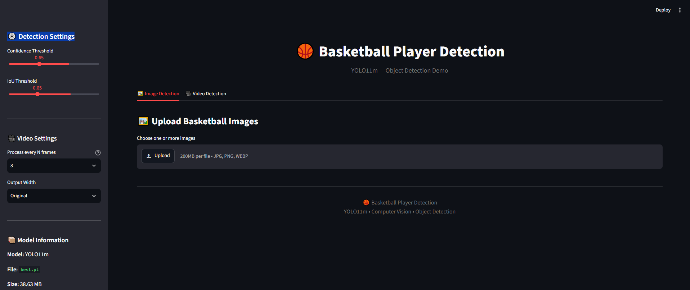
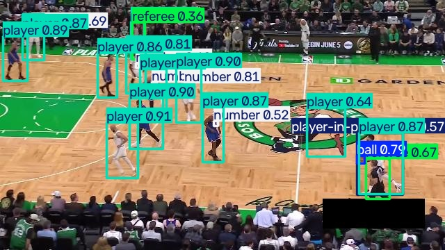

# 🏀 Basketball Player Detection

An end-to-end **Computer Vision object detection project** built with **YOLO11m** for detecting and analyzing basketball-related objects and actions in images and videos.

The project includes a trained YOLO11m model and an interactive **Streamlit web application** supporting image and video inference.

---

## 🎯 Project Overview

The system detects multiple basketball-related classes from images and videos.

The final model was evaluated on a dedicated test set containing:

* **94 images**
* **1,980 annotated instances**
* **9 object classes**

The project covers the complete computer vision workflow:

```text
Dataset
   ↓
Data Preparation
   ↓
YOLO11m Training
   ↓
Model Evaluation
   ↓
Best Model Selection
   ↓
Streamlit Application
   ↓
Image & Video Detection
```

---

## 🤖 Model

### YOLO11m

The project uses **YOLO11m** from Ultralytics.

Model information:

| Property                |           Value |
| ----------------------- | --------------: |
| Model                   |         YOLO11m |
| Parameters              |      20,037,742 |
| GFLOPs                  |            67.8 |
| Layers                  |             126 |
| Framework               |     Ultralytics |
| GPU used for evaluation | NVIDIA Tesla T4 |

The trained model is provided as:

```text
best.pt
```

Model size:

```text
~40.5 MB
```

---

## 🎯 Detection Classes

The final model detects **9 classes**:

| Class                   |
| ----------------------- |
| 🏀 ball                 |
| 🏀 ball-in-basket       |
| 🔢 number               |
| 🧍 player               |
| 🏀 player-in-possession |
| 🏀 player-jump-shot     |
| 🛡️ player-shot-block   |
| 👨‍⚖️ referee           |
| 🏀 rim                  |

---

# 📊 Model Performance

The final model was evaluated on the test set.

### Overall Results

| Metric        |      Score |
| ------------- | ---------: |
| **Precision** | **76.50%** |
| **Recall**    | **69.15%** |
| **mAP@50**    | **75.32%** |
| **mAP@50:95** | **53.15%** |

### Per-Class Results

| Class                | Precision |     Recall |    mAP@50 | mAP@50:95 |
| -------------------- | --------: | ---------: | --------: | --------: |
| ball                 |     83.7% |      58.5% |     68.4% |     38.6% |
| ball-in-basket       |     51.7% |      50.0% |     56.0% |     42.6% |
| number               |     79.6% |      89.4% |     90.2% |     48.4% |
| **player**           | **91.5%** |  **97.0%** | **96.6%** | **76.1%** |
| player-in-possession |     52.2% |      42.5% |     44.9% |     36.3% |
| player-jump-shot     |     73.2% |      50.0% |     69.9% |     50.0% |
| player-shot-block    |     63.3% |      37.1% |     53.3% |     37.9% |
| **referee**          | **96.1%** |  **97.9%** | **99.1%** | **80.6%** |
| **rim**              | **97.2%** | **100.0%** | **99.5%** | **67.9%** |

### ⭐ Key Result

The main `player` class achieved:

* **91.5% Precision**
* **97.0% Recall**
* **96.6% mAP@50**
* **76.1% mAP@50:95**

This demonstrates strong performance for the primary basketball-player detection task.

---

# 🖥️ Streamlit Application

The project includes an interactive Streamlit application for running the trained model without writing inference code.

The application provides two main modes:

### 🖼️ Image Detection

Users can upload:

* JPG
* JPEG
* PNG
* WEBP

Multiple images can be uploaded and processed.

For every image, the application:

1. Loads the image.
2. Runs YOLO11m inference.
3. Draws bounding boxes and class labels.
4. Displays the detection result.
5. Reports the number of detected objects.
6. Measures inference time.
7. Allows downloading the result.

---

### 🎥 Video Detection

The application supports:

* MP4
* AVI
* MOV
* MKV
* WEBM

Multiple videos can be uploaded.

The video pipeline performs:

```text
Input Video
     ↓
Frame Extraction
     ↓
YOLO11m Inference
     ↓
Bounding Box Rendering
     ↓
Video Reconstruction
     ↓
Browser-Compatible MP4
     ↓
▶️ Streamlit Video Player
```

After processing, the detected video can be **played directly inside Streamlit**.

The user does not need to download the processed video before viewing it.

---

# ⚙️ Detection Settings

The Streamlit application provides adjustable inference settings.

### Confidence Threshold

Controls the minimum confidence required for a detection.

### IoU Threshold

Controls the IoU threshold used during Non-Maximum Suppression.

### Frame Skip

For video processing:

```text
1 → Process every frame
2 → Process every second frame
3 → Process every third frame
```

This allows the user to trade detection detail for processing speed.

---

# 📸 Demo

## Streamlit Interface



## Image Detection



## 🎥 Video Demo

A demonstration video showing the basketball detection system running through the Streamlit application is available here:

[▶️ Watch the Video Demo](demo/Detected_Video.mp4)

---

# 📁 Project Structure

```text
Basketball-Player-Detection/
│
├── app.py
├── best.pt
├── README.md
├── requirements.txt
├── .gitignore
│
├── screenshots/
│   ├── Interface.PNG
│   └── Detected_Image.jpg
│
└── demo/
    └── Detected_Video.mp4
```

### Main Files

| File / Folder      | Description             |
| ------------------ | ----------------------- |
| `app.py`           | Streamlit application   |
| `best.pt`          | Trained YOLO11m model   |
| `requirements.txt` | Python dependencies     |
| `.gitignore`       | Ignored local files     |
| `screenshots/`     | Application screenshots |
| `demo/`            | Video demonstration     |

---

# 🛠️ Technologies

The project was developed using:

* **Python**
* **PyTorch**
* **Ultralytics YOLO**
* **YOLO11m**
* **OpenCV**
* **Streamlit**
* **Pillow**
* **NumPy**
* **FFmpeg**

---

# 💻 Installation

Clone the repository:

```bash
git clone https://github.com/AhmedSamy-Mohamed/Basketball-Player-Detection.git
```

Navigate to the project:

```bash
cd Basketball-Player-Detection
```

Create a virtual environment:

```bash
python -m venv venv
```

Activate the environment on Windows:

```powershell
.\venv\Scripts\Activate.ps1
```

Install dependencies:

```bash
pip install -r requirements.txt
```

---

# ▶️ Run the Application

Start Streamlit:

```bash
python -m streamlit run app.py
```

The application will open in your default browser.

---

# 🔍 How to Use

## Image Detection

1. Open the **Image Detection** tab.
2. Upload one or more basketball images.
3. Adjust the confidence threshold.
4. Click **Run Image Detection**.
5. View the detection results.
6. Download the processed images if required.

## Video Detection

1. Open the **Video Detection** tab.
2. Upload one or more basketball videos.
3. Select the desired frame-processing mode.
4. Click **Run Video Detection**.
5. Wait for processing to complete.
6. Play the processed video directly inside Streamlit.
7. Download the result if required.

---

# ⚡ Inference Performance

During model evaluation, the reported average processing times were:

| Stage          |          Time |
| -------------- | ------------: |
| Preprocessing  |  3.1 ms/image |
| Inference      | 14.7 ms/image |
| Loss           |  0.3 ms/image |
| Postprocessing |  9.6 ms/image |

The model was evaluated using an NVIDIA Tesla T4 GPU.

---

# 🔮 Future Improvements

Possible future improvements include:

* 🎯 Multi-object tracking
* 🏀 Basketball tracking
* 👕 Team classification
* 🔢 Automatic jersey-number recognition
* 📊 Player statistics
* 🏃 Player trajectory analysis
* 🏀 Court detection
* 🎥 Real-time webcam detection
* ⚡ GPU-accelerated deployment
* ☁️ Cloud deployment
* 📈 Real-time analytics dashboard

---

# 👨‍💻 Author

## Ahmed Samy Mohamed

**Mechatronics Engineering Student**
**Faculty of Engineering — Tanta University**

### Areas of Interest

* Computer Vision
* Machine Learning
* Artificial Intelligence
* Robotics
* Mechatronics

---

# ⭐ Project

If you find this project useful, consider giving it a ⭐ on GitHub.

**Repository:**

https://github.com/AhmedSamy-Mohamed/Basketball-Player-Detection
